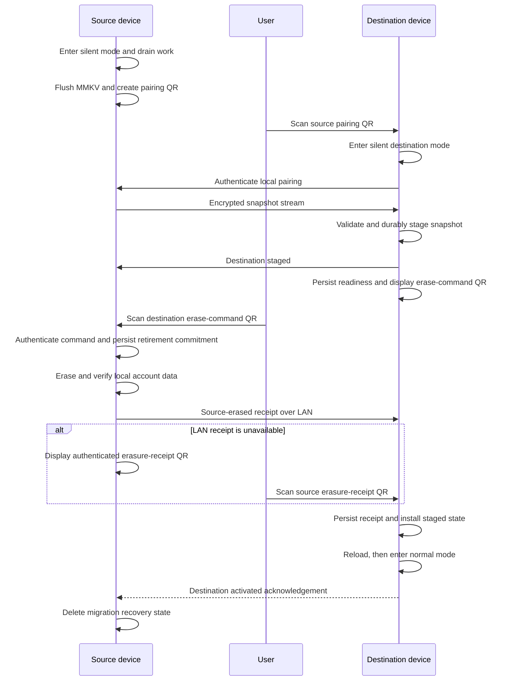

# Device migration specification

Status: Draft; local-only protocol

## Summary

Device migration moves one Vexl account from a source device to a fresh
destination installation. The complete snapshot travels directly over an
authenticated, encrypted local-network connection. Vexl backends do not
participate in the migration and do not learn that it happened.

The user, physically holding both devices, arbitrates the irreversible handoff:

1. The source displays an initial pairing QR and becomes completely quiescent.
2. The destination scans it, pairs locally, receives the snapshot, and durably
   stages and validates every entry.
3. The destination displays a short-lived, authenticated erase-command QR only
   after staging is complete.
4. The user may cancel safely until the source successfully scans and accepts
   that erase-command QR. Accepting it is the irreversible commit point.
5. The source persists the committed state, erases and read-back-verifies its
   account data, and produces an authenticated source-erased receipt.
6. The receipt is sent over the encrypted local connection. If that connection
   is unavailable, the source displays the same receipt as a recovery QR for the
   destination to scan.
7. The destination activates only after durably validating and storing the
   source-erased receipt. It then installs the snapshot, recreates the secure
   session, reloads the app, and permits ordinary Vexl traffic.

The existing logout operation must not be used. Logout deletes remote offers,
inboxes, contact-service state, user-service state, and notification state.
Device migration needs a new local-only source-retirement operation.

## Product decisions

The following decisions are part of this specification:

- Migration coordination and payload transfer are entirely local. There are no
  migration endpoints, device certificates, per-request device proofs, or
  server-side migration records.
- Internet access is not required during migration. A direct local network or a
  personal hotspot is sufficient.
- Both apps must run the same released app version and storage schema.
- The destination must be a fresh installation with no existing account.
- The payload includes MMKV account state, the logical session, chat images,
  profile images, and raw locally stored contacts.
- The initial pairing QR and erase-command QR are short-lived and single-use.
- QR, authentication-code, confirmation, and recovery-receipt screens always
  enable capture protection, regardless of the user's ordinary screenshot
  preference.
- The source remains authoritative and cancellation is safe until it accepts
  the destination's authenticated erase-command QR.
- The erase-command QR is available only after the destination has durably
  staged and validated a complete snapshot.
- Once the source accepts the erase command, neither device may cancel or return
  to its ordinary pre-migration state. Source retirement and destination
  recovery become mandatory.
- Source-erasure confirmation is a strict activation requirement. No timeout,
  user attestation, support action, or manual override may substitute for the
  authenticated source-erased receipt.
- If the source becomes permanently unavailable after accepting the erase
  command but before delivering the receipt, the destination remains dormant.
  The risk of an inaccessible account is accepted in favor of strict erasure
  confirmation.
- No migration payload, QR data, key material, IP address, contact data, file
  path, snapshot size, transfer identifier, or migration occurrence may be sent
  to Vexl, Sentry, analytics, logs, or metrics.
- The transport has explicit limits for frame size, entry count, file count,
  file size, total size, timeouts, and paths.

## Goals

1. Preserve the user's account identity, messages, offers, contacts, notes,
   clubs, notification decryption material, preferences, and local media.
2. Keep the migration protocol, metadata, and all payload bytes off Vexl
   servers.
3. Prevent normal or headless application work from mutating either device
   during the handoff.
4. Prevent the source from contacting Vexl after quiescence and prevent the
   destination from contacting Vexl before verified erasure and installation.
5. Make the ordinary source installation unable to use the account after the
   user authorizes retirement.
6. Make every transition crash-safe and recoverable without allowing the
   destination to activate before verified source erasure.
7. Install the snapshot in bulk and reload Jotai atoms from MMKV instead of
   writing custom migration logic for every atom.

## Non-goals

- Migrating into an installation that already contains an account.
- Migrating between different app or storage-schema versions.
- Cloud backup or server-relayed account payloads.
- Backend-enforced single-device authorization.
- Background migration.
- Continuing a migration while either app is locked or backgrounded.
- Proving secure physical erasure from flash storage.
- Protecting against a malicious or rooted source, a modified client, restored
  device backups, or account/resource keys copied outside the ordinary app.
- Rotating or revoking the stable account, offer, inbox, club, message, or
  notification encryption keys.

The security claim is deliberately procedural: the trusted Vexl app performs
and verifies logical source deletion before the destination activates. Because
the backend is not involved and account/resource keys migrate unchanged, a
hostile source that retained keys outside the ordinary app could still use
them. The product must not describe this feature as server-enforced revocation.

## Terminology

- **Source**: the currently logged-in device that holds the account.
- **Destination**: the fresh, logged-out installation receiving the account.
- **Account keys**: stable cryptographic keys used for account identity,
  resource ownership, chat, offers, clubs, and notification decryption.
- **Transfer keys**: directional, ephemeral keys derived for the encrypted local
  stream and the authenticated QR control messages.
- **Control store**: a dedicated, non-default MMKV/SecureStore namespace holding
  the minimal crash-recovery state machine. It is never included in a snapshot
  and deliberately survives source account-data cleanup and destination
  installation until completion is acknowledged.
- **Staging store**: encrypted destination storage containing the received
  snapshot before it becomes live application state.
- **Snapshot content digest**: a domain-separated SHA-256 commitment to every
  canonical logical value and file in the snapshot. Both devices compute it
  independently and bind it into the erase command and erasure receipt.
- **Erase-command QR**: an authenticated, destination-generated command proving
  that a complete snapshot is durably staged. Source acceptance is the
  irreversible commit point.
- **Source-erased receipt**: an authenticated record emitted only after source
  cleanup and read-back verification succeed. It travels over the encrypted
  local connection or as a source-displayed recovery QR.

## Required invariants

These invariants must be expressed in code and covered by automated tests:

1. No source account data is deleted before the source authenticates and
   durably accepts an erase command for the exact staged snapshot.
2. The destination cannot create a valid erase command until it has durably
   staged the complete snapshot and recomputed the source's snapshot content
   digest exactly.
3. Cancellation leaves the source account unchanged and usable only while the
   source has not accepted the erase-command QR.
4. After accepting the erase command, the source can never return to normal
   application mode; it can only finish erasure and provide the receipt.
5. After displaying the erase-command QR, the destination must preserve staging
   until it receives either a valid source-erased receipt or an authenticated
   source cancellation confirmation proving the command was not accepted.
6. The destination can never install the live session, enter normal application
   mode, or make a Vexl request before durably storing a valid source-erased
   receipt.
7. The source gate denies every Vexl request from quiescence through retirement.
   The destination gate denies every Vexl request until the source-erased
   receipt is persisted and installation succeeds, after which only the narrow
   activation allowlist is available.
8. Headless background and notification launches consult the durable control
   store before loading a session or importing application state.
9. A snapshot is accepted only if the app version, migration protocol version,
   storage schema version, manifest hash, per-entry hashes, snapshot content
   digest, entry schemas, file hashes, and limits all validate.
10. The source-erased receipt is emitted only after all required local cleanup
    operations succeed and read-back verification confirms absence.
11. The erase command, cancellation confirmation, and erasure receipt are
    authenticated, single-use, role-bound, and bound to the pairing transcript,
    transfer identifier, staged manifest digest, and snapshot content digest.
12. Account payload bytes and migration metadata are never written to logs,
    error reporting, analytics, Vexl requests, or other remote systems.

## Existing implementation constraints

### Persistence

The current account is split across multiple stores:

- Most application state is stored in the default MMKV instance through
  `atomWithParsedMmkvStorage`.
- The encrypted session is stored under `SESSION_KEY` in AsyncStorage.
- The session decryption secret is stored under `SECRET_TOKEN_KEY_V2` in
  `expo-secure-store` with device-only accessibility.
- `chat-images/` and `profilePicture/` are stored under the application document
  directory, and MMKV/session values can contain absolute URIs into that
  directory.

SecureStore files and raw MMKV database files must not be copied. SecureStore is
device-bound, and copying an open memory-mapped MMKV database would bypass
schema validation and be unsafe across platforms/library versions. Migration
exports logical values and recreates them through the destination APIs.

### Deferred MMKV writes

`atomWithParsedMmkvStorage` defers and coalesces writes behind
`InteractionManager`. Reading MMKV without first flushing those closures can
produce an older snapshot than the current UI state.

The storage wrapper must gain a registry containing each persisted key, schema,
migration policy, and pending-write flush function. Entering source snapshot
mode calls one synchronous `flushAllPendingMmkvWrites` operation before MMKV is
enumerated.

### Atom reload behavior

Mounted persisted atoms already subscribe to MMKV value changes. Atoms mounted
later compare their initial cached raw value with storage. Nevertheless, a full
JS reload after snapshot installation is required to eliminate ordering races
with derived atoms and loading tasks. The destination uses `reloadAppAsync`
after the migration journal and live session are fully committed.

No list of atom reset actions will be maintained.

## Architecture overview

The feature has four layers:

1. **Application execution mode** blocks and drains ordinary work.
2. **Snapshot subsystem** exports, validates, stages, and installs account data.
3. **Local transport and authenticated QRs** pair the devices, stream encrypted
   records, and carry the user-authorized commit and erasure proof.
4. **Recovery journal** makes every transition idempotent after crashes or
   disconnections.

The destination performs no connectivity probe, content request, metric, token
refresh, or authenticated Vexl request before it has persisted the
source-erased receipt and installed the migrated session. Its first requests are
ordinary post-login reconciliation and notification activation, not migration
protocol calls.

## Application execution modes

Migration mode must not be represented only by a Jotai atom. Headless launches
and early module initialization can run before Jotai UI state exists. The mode is
stored synchronously in the dedicated control store and is checked before the
normal splash/session loader mounts.

The top-level boot order becomes:

1. Read and validate the migration control record.
2. Resolve a required recovery transition, if any.
3. Mount the migration-only root or the normal animated splash root.
4. Load the ordinary account session only in normal mode.

The migration-only root must not mount:

- `useInAppLoadingTasks`;
- `VersionMigrations`;
- `LoggedInHookGroup`;
- the notification socket;
- notification-open handlers;
- background-task setup;
- badge management;
- deep-link handling;
- typing indication management;
- offer upload progress management;
- any account screen or action that can write persisted state.

### Defense-in-depth silence gates

All of the following are required. No single gate is sufficient by itself.

#### In-app task scheduler

The task scheduler checks the execution mode both before constructing a task
wave and immediately before each task starts. Entering migration mode prevents
new work and interrupts tracked task fibers.

The current fire-and-forget `Effect.runPromise` calls need a managed scope/fiber
registry so migration can request quiescence and wait for completion.

#### Vexl HTTP transport

Every mobile Vexl HTTP client is wrapped in a shared request gate below the API
methods. In migration mode it fails before DNS resolution or socket creation.
This applies to authenticated and unauthenticated Vexl endpoints, including
content, metrics, exchange-rate, feedback, and location services.

The source allowlist is empty from quiescence until either safe pre-commit
cancellation restores normal mode or retirement completes. The destination
allowlist is empty until the source-erased receipt is persisted and snapshot
installation succeeds. No migration-specific Vexl request exists.

After installation, destination activation may use a narrow typed allowlist for
the ordinary notification-metadata update and account reconciliation required
before normal mode. Operations are allowlisted by typed identifiers, never by
substring or arbitrary URL matching.

#### In-flight request drain

The shared transport tracks active requests. Source quiescing performs these
steps in order:

1. Persist `sourceQuiescing` so no new work can begin.
2. Close normal navigation and stop accepting UI actions.
3. Interrupt managed task and notification-stream fibers.
4. Block all new Vexl requests.
5. Cancel interruptible active requests and wait for the active count to reach
   zero.
6. If the drain does not finish within 10 seconds, fail entry into migration and
   restore normal mode without creating a QR.
7. Flush deferred MMKV writes synchronously.

The snapshot cannot start while an ordinary Vexl request is in flight.

#### Scheduled background task

`processBackgroundTask` reads the control store before `loadSession`. Every
migration mode returns `Success` without reading or mutating account storage and
without contacting a network.

#### Notification background task and foreground handlers

The notification `TaskManager` handler reads the control store before extracting
or logging notification data. In migration mode it returns `NoData` and performs
no decoding, reporting, local display, storage update, or network request.

The foreground notification stream is interrupted during quiescing and cannot
restart until normal mode. Notification-open responses are ignored by the
migration root.

Pushes already accepted by the operating system cannot be cryptographically
recalled. The application guarantee is that Vexl does not process or persist
them. Source retirement clears local notification state and handlers without
calling Vexl. Messages arriving during the gap remain retrievable from server
inboxes and are fetched by the destination after activation. The destination's
ordinary notification-metadata refresh replaces the source Expo token.

#### State writers outside the task system

Utilities such as `setLastTimeAppWasRunningToNow`, version migrations, deep-link
cursors, notification caches, and log capture also write MMKV. They must not be
mounted or invoked in migration-only roots.

#### Error reporting and telemetry

Migration code uses dedicated tagged errors with an enumerated, non-sensitive
error code. Errors are shown locally. They are not passed with arbitrary causes,
request objects, manifests, frame data, paths, keys, or extras to `reportError`.

If aggregate migration reliability metrics are added later, they require a
separate privacy review. This specification does not authorize them.

## Local pairing and transport

### Connectivity

The source starts a local TCP listener when the initial pairing QR becomes
visible and keeps it only for the active transfer/recovery session. The QR
carries the source's reachable local endpoints, so no LAN scan, mDNS, or Bonjour
discovery is needed.

The native transport should be a small in-repository Expo module using
`NWListener`/`NWConnection` on iOS and platform sockets on Android. It exposes
framed byte streams, listener lifecycle, local endpoint discovery, connection
cancellation, and foreground-state failure. Application-layer authenticated
encryption is mandatory; cleartext LAN trust is never assumed.

The app must provide a migration-specific iOS local-network usage description
and handle current/future Android local-network runtime permissions. Permission
denial is recoverable and cannot change account state.

### Initial pairing QR

The QR contains only:

- QR schema version;
- migration protocol version;
- exact app/storage version;
- random transfer identifier;
- issue and expiry timestamps;
- source endpoint candidates;
- source ephemeral key-exchange public key;
- one-time pairing capability;
- checksum/encoding metadata.

It never contains account/session keys, phone numbers, contacts, snapshot data,
or Vexl credentials.

The QR expires five minutes after creation, is invalidated after the first
authenticated destination is accepted, and is regenerated with new keys after
cancel/retry. A QR may be at most 2 KiB after encoding.

### Handshake

1. The destination validates the QR schema, expiry, version equality, and local
   endpoint before connecting.
2. Both sides generate ephemeral X25519 key-exchange keys.
3. The destination proves knowledge of the QR pairing capability.
4. Both sides derive separate stream keys and directional QR-authentication keys
   using libsodium `crypto_kx` plus domain-separated key derivation.
5. All transcript fields, roles, versions, and transfer identifiers are bound
   into key derivation/authenticated data.
6. Both screens display the same short authentication string derived from the
   transcript.
7. The user confirms the code on both devices, with final approval on the
   source.
8. The source accepts at most one destination and closes the listener to other
   clients.

The short code is a human confirmation aid, not the cryptographic key.

### Encrypted stream

Application records use libsodium
`crypto_secretstream_xchacha20poly1305`. Each frame is length-prefixed, role and
protocol bound, ordered, authenticated, and subject to the limits below. The
final stream tag is required. Truncation, reordering, duplication, corruption,
unknown record types, or trailing bytes fail the transfer.

Control messages and snapshot records are separate typed Effect schemas. No
external data is trusted without `Schema.decodeUnknown` validation.

### Erase-command QR and local commit

After the destination has durably staged and validated the snapshot, it persists
`destinationEraseCommandAvailable` and creates an erase-command QR containing
only:

- QR schema, migration protocol, and storage version;
- transfer identifier;
- staged manifest digest;
- snapshot content digest;
- random, single-use command nonce;
- issue and expiry timestamps;
- digest of the destination's durable staging receipt;
- a MAC made with the destination-to-source QR-authentication key.

The destination displays the QR only after an explicit warning that scanning it
will erase the source and make cancellation impossible. The QR expires after
five minutes and can be regenerated with a new nonce while the same validated
staging package remains intact.

The source accepts the command only from its dedicated migration scanner and
validates its schema, versions, expiry, MAC, role, transfer identifier, manifest
digest, staging-receipt digest, unused nonce, and snapshot content digest. The
digest comparison is against the source's independently computed value and uses
a constant-time comparison. The source then synchronously persists
`sourceRetirementCommitted` before showing scan success, acknowledging over the
local channel, or deleting any account data. Successful acceptance is the
irreversible commit point. A crash afterward resumes retirement before loading
the session or running normal work.

The erase command authorizes only local retirement for the exact paired
snapshot. It contains no account data and authorizes no Vexl request.

### Cancellation before the erase command

Either device may cancel normally before the erase-command QR is displayed. The
source returns to normal mode unchanged, and the destination deletes staging
and transfer secrets.

Once the erase-command QR has been displayed, the destination cannot know from
its own state whether the source scanned it, especially after a disconnect. It
therefore preserves staging until it receives one of two authenticated outcomes:

- a source-erased receipt; or
- a source cancellation confirmation proving that the source never accepted
  the command and has returned to normal mode.

Before accepting the erase command, the source may persist and send that
cancellation confirmation over the authenticated local channel or display it as
a short-lived QR for the destination to scan. After accepting the erase command,
the source must reject cancellation. This lets the user cancel safely at any
time before the final erase-command scan without allowing the destination to
discard the only staged copy after an ambiguous disconnect.

### Source-erased receipt and recovery QR

The source creates a receipt only after every retirement step and read-back
verification succeeds. The receipt contains only:

- QR schema and migration protocol version;
- transfer identifier;
- staged manifest digest;
- snapshot content digest;
- accepted erase-command digest and nonce;
- random receipt nonce;
- a coarse successful-cleanup result digest;
- a MAC made with the source-to-destination QR-authentication key.

The source first attempts to send the receipt over the authenticated local
channel. It also stores the receipt in its minimal control journal and can
display it as a recovery QR. The destination applies the same schema, binding,
MAC, replay, and state checks whether the receipt arrives over LAN or QR.

Unlike pairing and erase-command QRs, an erasure receipt does not expire while
the destination remains unactivated. Expiry could permanently strand a valid
staged account. It is single-use and remains available on the retired source
until the destination sends an authenticated activation acknowledgement or the
user explicitly resets the already-retired source after a data-loss warning.

The destination persists the verified receipt before installing account data or
opening its Vexl network gate. Visual inspection of the source screen, elapsed
time, or user confirmation without the authenticated receipt is insufficient.

### Transport limits

Initial limits are deliberately conservative and must be constants covered by
boundary tests:

- Any QR payload: 2 KiB.
- Handshake message: 64 KiB.
- Control frame plaintext: 64 KiB.
- Data chunk plaintext: 64 KiB.
- MMKV key length: 256 UTF-8 bytes.
- MMKV entry count: 4,096.
- One MMKV value: 64 MiB.
- File relative-path length: 512 UTF-8 bytes.
- File count: 4,096.
- One file: 25 MiB.
- Total uncompressed snapshot: 1 GiB.
- Handshake inactivity timeout: 15 seconds.
- Human verification timeout after authenticated pairing: 5 minutes.
- Stream inactivity timeout: 30 seconds.
- Time to initiate after scanning: 5 minutes.
- Maximum connected migration duration: 15 minutes.

If real-world account measurements require higher limits, changing them needs a
separate memory/disk/DoS review. Values and sizes remain local and must not be
reported.

The implementation streams fixed-size chunks and never constructs the full
snapshot, a complete file, or a base64 archive in JS memory.

## Snapshot format

The top-level manifest contains:

- snapshot schema version;
- exact app version;
- storage schema version;
- migration protocol version;
- creation timestamp;
- typed MMKV entry descriptors;
- logical session descriptor;
- file descriptors with normalized relative path, byte length, and SHA-256;
- record counts and total length for local validation;
- manifest digest;
- snapshot content digest.

The manifest and every following byte are inside the authenticated stream.
Counts and sizes are never sent to telemetry.

### Snapshot content digest

The snapshot content digest provides an end-to-end commitment independent of
transport encryption and staging encryption. It covers every migrated logical
byte, including MMKV keys, native MMKV types and values, the decoded logical
session, canonical file paths, and file contents.

For each record, the exporter computes a SHA-256 leaf over a versioned,
domain-separated, length-prefixed binary encoding of:

- record kind;
- canonical key, identifier, or normalized path;
- native type and declared byte length;
- exact logical value or file bytes.

The root is SHA-256 over a device-migration domain tag, the protocol/storage
versions, the manifest digest, and the ordered sequence of leaf kinds, lengths,
and digests. MMKV records are ordered by UTF-8 key bytes, the logical session has
a fixed position, and files are ordered by normalized UTF-8 path bytes. JSON
property order, platform path syntax, destination sandbox URIs, randomized
encryption bytes, and filesystem enumeration order never affect the result.

To avoid circular hashing, the manifest digest is computed from the canonical
manifest with both digest fields omitted. The finalized manifest then carries
that manifest digest and the separately computed snapshot content digest.

The source computes and persists the root while preparing the immutable
snapshot. The destination independently computes it while receiving, then
re-reads the durable staging package and computes it again before creating the
erase-command QR. `DestinationStaged`, the erase-command QR, and the
source-erased receipt all carry the same root. The source rejects the erase
command unless that root exactly matches its stored value.

After installation, the destination reads the installed MMKV values, logical
session, and files back through canonical migration projections and recomputes
the root one final time. URI relocation and fields deliberately classified as
`rebuild` are projected back to their canonical snapshot representation. The
Vexl network gate remains closed and staging remains intact until this final
root matches. A mismatch retries installation from staging or remains in local
recovery; it never activates partially installed state.

The digest is sensitive migration metadata. It is never logged, reported,
placed in analytics, or sent to Vexl.

### Typed MMKV entries

MMKV supports strings, booleans, numbers, and buffers. Each exported entry is a
schema-validated tagged union containing its key, native type, and value. Import
must preserve the native type. Trying `getString` for every key is insufficient
because the current store includes boolean values and may gain other native
types.

The exporter enumerates `getAllKeys`, resolves every key through the migration
registry, reads the declared type, and verifies its schema. An unknown key fails
snapshot creation by default. It is never silently copied.

Dynamic key families such as `hideForMessage-<messageId>` register a validated
key prefix/parser and value schema.

### Migration policy registry

Every persisted atom/key must declare one policy:

- `account`: exact account data required on the destination;
- `preference`: user-facing preference that follows the account;
- `rebuild`: logical state is migrated, but device-local fields are removed and
  rebuilt after activation;
- `deviceLocal`: installation/OS-specific value that is not migrated;
- `ephemeral`: cache, diagnostic, replay cursor, or transient state that is not
  migrated;
- `lifecycle`: storage-migration metadata handled by the installer.

There is no permissive default. Adding a persisted key without an explicit
policy must fail typecheck/test registration.

A registry test creates/loads all persistence modules, compares registered keys
and dynamic families with a representative MMKV inventory, and fails on unknown
or duplicate ownership.

### Current policy guidance

The implementation must perform a final inventory, but the current values are
expected to follow this policy:

#### Account or preference

- `messagingState`, `offers`, `storedContacts`, `notes`;
- connection state and offer/note/repost-to-connection state;
- club membership, member data, and club key holders;
- notification-token/cypher-to-key-holder mappings required to decrypt notices;
- notification center records and relevant product-notification cursor;
- account stats, donations, reported-message state;
- offer filters and user-visible suggestion/dismissal state;
- post-login progress and user-facing preferences;
- dynamic per-message hidden state;
- stable Vexl notification secret and Vexl notification tokens.

#### Rebuild or split before migration

- `vexlNotificationToken`: migrate the stable secret/tokens, but remove
  `lastUpdatedMetadata.expoToken` and other source-device metadata. Prefer
  splitting device metadata into its own storage key rather than embedding a
  custom atom-specific transformer.
- `tradeReminders`: migrate logical chat/meeting/reminder times, but never the
  source OS notification identifier. Reschedule local notifications only after
  destination activation.
- user preferences: migrate user-facing choices, but split/reset developer,
  benchmark, preview-channel, and task-debug settings.
- file URIs: migrate referenced content using canonical archive paths and map to
  new destination URIs during installation.

#### Device-local or ephemeral

- cached Expo push token `notificationToken`;
- notification server public-key cache and refresh time;
- OS calendar identifier `vexlCalendar`;
- already-presented system notification identifiers;
- new-offer local notification timing/cache;
- last route and deep-link replay state;
- login-attempt UI state;
- BTC price cache;
- action benchmarks and PR preview channel;
- app logs and log-enabled state;
- last-app-running time;
- `__clear_storage`, MMKV data-loss sentinels, AsyncStorage sentinels;
- source session-secret-written diagnostic marker;
- device migration control/staging keys.

The old `importedContacts` migration key is not exported when the canonical
`storedContacts` value exists. Lifecycle state records that the canonical
snapshot already matches the shared storage schema, preventing old version
migrations from running against partially installed data.

### Logical session

The source reads and decodes the existing session through the normal session
schema. The snapshot contains stable account identity, resource keys, phone
number, profile data, and compatibility credentials required to reconstruct the
new session. Account and resource credentials migrate unchanged; this feature
does not rotate or revoke them on Vexl backends.

On destination installation:

1. validate the migrated account identity and existing session sanity checks;
2. create a fresh random destination-local session encryption secret;
3. encode the logical session using the current session schema;
4. write the SecureStore item using destination device-only options;
5. write the AsyncStorage encrypted session as the last account-data commit
   marker.

Migration-specific session installation must be journaled. The ordinary
session writer currently writes AsyncStorage before SecureStore, which can leave
an encrypted session without its secret after a crash. The installer either
writes the SecureStore secret first and AsyncStorage commit marker last or
recovers the interrupted transaction before normal session loading.

### Files and URI normalization

Only files reachable under these approved roots are migrated initially:

- `chat-images/`;
- `profilePicture/`.

Every file is represented by a normalized POSIX relative path. The exporter and
importer reject:

- absolute paths;
- `..` segments;
- empty or dot-only segments;
- backslash separators;
- NUL/control characters;
- symlinks;
- roots outside the allowlist;
- duplicate normalized paths;
- case-folding collisions;
- mismatched size or hash.

Absolute source sandbox URIs cannot be installed on another device. During
export, exact known document-root URIs are replaced by canonical migration file
references. During import, those references are resolved to the destination
document directory. Any unresolved source `file://` URI in an account/session
value fails validation instead of producing a broken message image.

### Snapshot consistency

The source takes the snapshot only after quiescence and a synchronous flush of
all pending MMKV writes. Once snapshotting begins, source account persistence is
read-only until safe cancellation or irreversible erase-command acceptance.

Remote messages or offers can change on the server during transfer. That is
expected. The destination refreshes server-backed state after activation. The
source must not pull/delete messages or update server state after quiescence,
which prevents a gap where data exists on neither device nor server.

## Destination staging and installation

### Fresh-install precondition

Before pairing, the destination verifies locally that:

- no session exists in AsyncStorage;
- no account session secret exists in SecureStore;
- approved account file roots are absent/empty;
- no unresolved older migration journal exists.

The default MMKV store is not part of this precondition. Logged-out state is
established by the absence of the session, and the installer clears the whole
default MMKV instance before applying the incoming snapshot. If a session,
account file, or unresolved migration journal exists, migration is blocked and
the user must deliberately clear the local installation first.

This check does not contact Vexl.

### Encrypted staging

Received network ciphertext is persisted into a staging directory while each
decrypted chunk is validated in bounded memory. A staging key required for crash
recovery is held in migration-specific device-only SecureStore and deleted after
completion or authenticated safe cancellation.

Plaintext account archives must not be left in cache or temporary directories.
Staging filenames are random and reveal neither account identity nor original
paths.

Before sending `destination staged`, the destination verifies:

- final authenticated-stream tag;
- complete manifest and record counts;
- every schema and policy;
- all per-entry hashes and lengths;
- the independently recomputed snapshot content digest;
- all limits and paths;
- exact version equality;
- session sanity;
- enough free disk for installation and recovery.

Only after these checks and durable `destinationStaged` state may the destination
create and display the authenticated erase-command QR.

Required free space is at least twice the declared uncompressed snapshot size
plus 100 MiB. This allows staging plus an idempotent live install. An optimized
atomic rename design may lower this only after dedicated crash testing.

### Installation order

Installation begins only after the source-erased receipt is durably stored.

1. Persist destination state `sourceEraseConfirmed`.
2. Invalidate all deferred/default-MMKV writes that could overwrite imported
   values.
3. Create approved live file directories and install verified files.
4. Replace the default MMKV contents using typed writes from the registry.
5. Apply lifecycle markers for the exact storage schema.
6. Construct and validate the new destination session.
7. Write destination SecureStore values.
8. Write AsyncStorage session last.
9. Re-read the installed logical state, recompute the snapshot content digest,
   verify exact equality, and re-read session sanity.
10. Enter activation-only mode, open the Vexl gate for ordinary notification
    metadata and account reconciliation, and complete those required tasks.
11. Mark migration locally complete.
12. Call `reloadAppAsync`.
13. On the new boot, load the session/atoms normally and only then mount normal
    tasks, notification streams, and navigation.

The install is idempotent. A crash at any step resumes from the journal without
requiring the source account data.

## Source local retirement

After the source accepts the authenticated erase-command QR, retirement is
mandatory and cannot be cancelled. It is a new awaited operation, not
`logoutActionAtom`.

It performs and verifies:

1. ordinary Vexl HTTP and socket gates remain closed;
2. normal/background task fibers remain stopped;
3. notification processing remains disabled;
4. the AsyncStorage session is deleted;
5. legacy and current session SecureStore entries are deleted;
6. pending MMKV writes are invalidated;
7. default MMKV account state is cleared and read back as absent;
8. chat image and profile-picture roots are deleted and read back as absent;
9. scheduled local trade reminders/account notifications are cancelled;
10. notification badge and delivered local notifications are cleared;
11. in-memory session/atoms become logged out;
12. a minimal `cleanupComplete` record is written in the separate control store.

It explicitly does not:

- delete offers;
- delete/leave inboxes or chats;
- delete contact-service or user-service records;
- leave clubs;
- invalidate the shared Vexl notification secret/tokens;
- send metrics, feedback, logs, or deletion requests.

Every cleanup step is awaited and retried after a crash. Fire-and-forget
SecureStore deletion is not acceptable here.

The control store may retain only the transfer identifier, pairing-transcript
digest, staged-manifest digest, snapshot content digest, accepted erase-command
digest and nonce, cleanup status, source-erased receipt, and directional
QR-authentication material needed to prove cleanup over a resumed local channel
or recovery QR. These are not account or resource keys. They remain until
destination acknowledgement. If the user explicitly resets the already-retired
source first, the UI must warn that the strict destination may become
permanently inaccessible.

## State machines and recovery

### Source states

`normal`

- Normal app behavior.

`sourceQuiescing`

- Blocks new work and drains active work.
- Safe to cancel back to `normal` if drain fails.

`sourceServing`

- QR/listener active and account persistence read-only.
- Safe to cancel back to `normal`; account data is unchanged.

`sourceSnapshotSent`

- Destination is validating/staging.
- Safe to cancel and return to `normal`; no erase command has been accepted.

`sourceAwaitingEraseCommand`

- Destination has confirmed durable staging and may display the erase-command
  QR.
- The source remains unchanged and may still cancel.
- Safe cancellation emits an authenticated source cancellation confirmation so
  the destination may delete staging even after an ambiguous disconnect.

`sourceRetirementCommitted`

- The source authenticated the erase-command QR and durably recorded the
  irreversible transition.
- Only local erasure and receipt recovery are allowed. Cancellation and normal
  session loading are permanently forbidden.

`sourceErasing`

- Retry local cleanup until every required step verifies.

`sourceErasedAwaitingDestinationAck`

- Only the minimal recovery listener/UI is available.
- Repeatedly offers the authenticated receipt over LAN and displays the
  erasure-receipt recovery QR.

`sourceComplete`

- Destination acknowledged activation.
- Delete migration control secrets and show the normal logged-out welcome flow.

### Destination states

`normalLoggedOut`

- Fresh-install validation may start migration.

`destinationReceiving`

- Vexl egress denied; local authenticated stream only.

`destinationStaged`

- Complete encrypted staging package is durable and validated.
- Safe to cancel before an erase-command QR is displayed.

`destinationEraseCommandAvailable`

- The authenticated erase-command QR is displayed after the irreversible-action
  warning.
- Staging is protected from automatic deletion because the destination may not
  know whether the source scanned the QR.

`destinationAwaitingSourceOutcome`

- The erase command may have been scanned or the local connection may be
  ambiguous.
- Vexl egress remains denied.
- Only an authenticated source-erased receipt or source cancellation
  confirmation resolves this state.

`destinationSourceEraseConfirmed`

- The authenticated local source-erased receipt is durably stored.
- Installation may begin, but Vexl egress remains denied until installation
  succeeds and activation-only mode starts.

`destinationInstalling`

- Idempotently installs staged state while the migration-only root remains
  mounted.

`destinationActivating`

- Only ordinary notification activation and account-reconciliation requests are
  allowed initially.

`destinationComplete`

- Staging/control secrets are deleted and normal app boot is allowed.

### Failure rules

- Pairing, validation, permission, version, disk, or LAN failure before the
  erase-command QR is displayed: delete destination staging and transfer keys,
  then restore the source unchanged.
- Cancellation after the erase-command QR is displayed but before source
  acceptance: the source returns to normal only after persisting an
  authenticated cancellation confirmation. The destination deletes staging
  only after receiving that confirmation over LAN or QR.
- Source crash before erase-command acceptance: boot into cancellable source
  recovery with account data intact and Vexl egress still denied until the user
  resumes or cancels migration.
- Source crash after erase-command acceptance: boot directly into idempotent
  erasure without loading the normal session or running tasks.
- Source crash after erasure but before receipt delivery: retain only the
  control journal and expose the recovery QR/listener containing the existing
  authenticated receipt.
- Destination crash before source-erased confirmation: boot into dormant
  migration recovery with staging preserved and all Vexl egress denied.
- Destination crash after source-erased confirmation: resume idempotent install
  and activation. The source is no longer needed for account payload recovery.
- LAN disconnect after the erase-command scan: the source completes erasure and
  displays its receipt QR; the destination opens its receipt scanner. The local
  network is no longer required.
- Time passing, restarting either app, or confirming a warning manually never
  advances a destination that lacks the authenticated source-erased receipt.
  Only the original source control journal can produce the valid LAN/QR receipt.
- Permanent loss, destruction, or reset of the source after local erasure but
  before receipt delivery can leave the staged destination inaccessible
  indefinitely. This is an explicitly accepted consequence of the strict
  policy; support tooling must not bypass it.
- Destination loss, staging deletion, or uninstall after erase-command
  acceptance and source erasure can cause account data loss. Both devices must
  explain this irreversible risk before the source scans the command.

## Local protocol messages

All messages are typed, role-bound, and encrypted after the initial hello:

1. `ClientHello`
2. `SourceHello`
3. `PairingProof`
4. `PairingAccepted`
5. `HumanCodeConfirmed`
6. `SnapshotManifest`
7. `MmkvEntryStart` / `DataChunk` / `EntryEnd`
8. `FileStart` / `DataChunk` / `FileEnd`
9. `SnapshotEnd`
10. `DestinationStaged`
11. `CancelRequested`
12. `SourceCancellationConfirmed`
13. `EraseCommandAccepted`
14. `SourceErased`
15. `DestinationReceiptStored`
16. `DestinationActivated`
17. `Close`

`EraseCommand`, `SourceCancellationConfirmed`, and `SourceErased` also have QR
encodings. They use the same Effect schemas and state validation as their LAN
forms. `SourceErased` includes the accepted command digest, cleanup result
digest, snapshot content digest, and a MAC bound to the pairing transcript and
staged manifest. This proves what the normal source app did; it cannot prove
physical erasure against a hostile OS/device.

Unknown messages or messages invalid for the current state terminate the
connection. No state transition depends only on an unpersisted message.

## Notification handoff

The stable Vexl notification secret, system/marketing Vexl tokens, and token-to-
decryption-key mappings are account data and migrate.

The Expo push token and `lastUpdatedMetadata.expoToken` are source-device data and
do not migrate. The source does not invalidate the shared Vexl secret during
retirement.

After source-erased confirmation, destination activation:

1. obtains its own Expo token;
2. updates notification metadata for the migrated Vexl secret;
3. refreshes the session notification token if the existing token model
   requires it;
4. runs the existing conditional repair tasks for offers/chats whose routing
   token is actually missing; it does not blanket re-upload resources;
5. starts the foreground notification stream only after the activation steps
   succeed or enter a recoverable activation-error screen.

Until then, notification handlers on both apps are silent. Account state is
reconciled from backend sources after activation rather than trusting missed OS
notifications.

## UI requirements

All new UI follows `docs/ui_coding_guideline.md` and uses shared
`@vexl-next/ui` components.

### Source entry

Add `Move account to another device` to App Settings. The flow explains:

- both devices need the same Vexl version and a direct local network or personal
  hotspot; internet is not required during migration;
- both apps must remain open and unlocked;
- the source will stop normal activity during transfer;
- the source account data will be erased when the source scans the destination's
  final erase-command QR;
- cancellation is safe until that QR is successfully scanned and accepted.

The QR screen starts only after successful quiescence. Capture protection is
forced before the QR or authentication code renders and remains forced through
source completion/recovery.

### Destination entry

Add `Move account from another device` to the logged-out login flow without
triggering the normal intro action that clears storage. The destination verifies
fresh-install state before requesting camera/local-network permissions.

The destination stays on a dedicated migration root even after receiving a
valid account session. It must not briefly mount logged-in navigation/hooks.

After staging and validation, the destination explains the irreversible step
and displays the erase-command QR. It does not send an erase command silently
over the network. The user must physically present Device B to Device A's
dedicated scanner.

### Confirmation and progress

- Both devices display the same human authentication code.
- The source performs the final pairing approval.
- Progress UI may display local progress but must not log/report counts or bytes.
- Both active migration screens hold a keep-awake lease so ordinary display
  timeout cannot cancel a long transfer.
- Immediately before displaying and scanning the erase-command QR, both screens
  explain that scanning is the irreversible commit point.
- The same confirmation explains that if the source is lost, destroyed, reset,
  or otherwise becomes unavailable before it delivers its verified erasure
  receipt, the destination cannot be activated and there is no manual recovery
  override.
- After verified erasure, the source shows `Data erased — continue on your new
device` and an authenticated erasure-receipt QR. If LAN delivery did not
  succeed, the destination opens its scanner and requires this QR.
- A connection failure after the erase-command scan never offers `Start over`
  or deletes destination staging. It directs the user to the source receipt QR.
- Backgrounding, locking, or losing capture protection before the erase-command
  QR is displayed cancels safely. Once that QR has been displayed, cancellation
  follows the authenticated source-confirmation flow. After the source accepts
  it, both devices move only through retirement/recovery.
- Error messages use local enumerated codes and actionable recovery instructions.

## Privacy and security requirements

- No Vexl backend migration request is made and no server-side migration record
  exists. Vexl does not receive the snapshot, manifest, hashes, paths, local IPs,
  QR payloads, transfer counts, contacts, media, or a migration identifier.
- Migration code emits no remote logs, analytics, metrics, or Sentry events,
  including success/failure events that would reveal a migration occurred.
- Local IP endpoints are displayed/used only in memory/QR and the encrypted
  control journal when strictly required for reconnect; they are deleted on
  expiry.
- QR/codes are hidden from screenshots, recordings, recent-app snapshots, and
  debug overlays.
- Pairing and staging keys use device CSPRNG output and are zeroed/deleted after
  use where the runtime permits.
- No plaintext snapshot is placed in shared storage, cache exports, logs, crash
  reports, or system share sheets.
- Destination staging uses device-only protected storage and is deleted only on
  completion or authenticated safe cancellation. It never expires after an
  erase command might have been accepted.
- Local listeners bind only for the active migration, accept one authenticated
  peer, enforce limits before allocation, and close on background/lock.
- The importer never trusts filenames, types, counts, lengths, or JSON from the
  source without validation.
- Source and destination compare exact app/storage versions before any account
  payload is sent.

## Version compatibility

For this feature, "same version" means equality of:

- user-visible app semantic version;
- device migration protocol version;
- snapshot/storage schema version.

Platform-specific iOS build numbers and Android version codes may differ only if
they identify the same published cross-platform release and the three values
above are equal. Otherwise migration is rejected before pairing confirmation.

The snapshot protocol is versioned from the first release even though v1 accepts
only exact equality. Future compatibility requires a new reviewed protocol; it
must not be inferred automatically.

## Testing requirements

### Unit tests

- QR and every protocol schema reject unknown/malformed/expired input.
- Key exchange, role binding, human code, and transcript derivation are
  deterministic under test vectors.
- Secretstream rejects corruption, truncation, reordering, duplication,
  trailing frames, wrong roles, and wrong final tags.
- Snapshot content digest test vectors cover every record type, native MMKV
  type, ordering rule, length prefix, and domain/version tag.
- Any one-byte change to a key, type, value, logical session, canonical path, or
  file changes the snapshot content digest and blocks erase/activation.
- Every limit is tested immediately below, at, and above its boundary.
- Path validation rejects traversal, absolute paths, collisions, control
  characters, symlinks, and disallowed roots.
- MMKV native string/boolean/number/buffer types round-trip exactly.
- Every registered persisted key has one migration policy and unknown keys fail.
- All pending MMKV atom writes flush before snapshot enumeration.
- Device-local and ephemeral keys never appear in snapshots.
- Rebuilt notification/reminder state contains no source OS identifiers/tokens.
- Session construction uses a fresh destination-local SecureStore secret and
  writes the AsyncStorage commit marker last.
- Source retirement never invokes ordinary logout/server-deletion actions.
- The destination cannot create an erase command before durable staging and
  complete validation.
- Erase commands reject wrong roles, transfer IDs, manifests, staging receipts,
  snapshot content digests, MACs, expired timestamps, and repeated nonces.
- Source acceptance persists `sourceRetirementCommitted` before any cleanup
  action or success acknowledgement.
- Source cancellation confirmation can be created only before erase-command
  acceptance and is bound to the exact transfer.
- A source-erased receipt cannot be created until every cleanup step verifies;
  it rejects substitution, replay, and use by another staged snapshot.

### Local protocol/state-machine integration tests

- Every state transition is idempotent across process death and message replay.
- Safe cancellation before erase-command acceptance restores the source and
  deletes destination staging only after the required cancellation proof.
- Once the source accepts an erase command, cancellation is rejected and every
  reboot resumes retirement before session loading.
- Once an erase-command QR is displayed, the destination never deletes staging
  based only on timeout, disconnect, restart, or local user confirmation.
- LAN and QR encodings of cancellation confirmation and source-erased receipt
  produce identical validated domain records.
- Source-computed, received-staging, re-read-staging, QR, erasure-receipt, and
  installed-state snapshot content digests must all be identical.
- A LAN drop immediately after erase-command acceptance still completes through
  the source erasure-receipt QR.
- The destination remains dormant indefinitely without a valid source-erased
  receipt; time and manual confirmation do not unlock it.
- No migration flow invokes a migration-specific Vexl endpoint or creates
  backend migration state.

### Mobile integration tests

- iOS to iOS, Android to Android, iOS to Android, and Android to iOS.
- Large message history, maximum-sized files, thousands of contacts, and all
  MMKV native types.
- Profile/chat image URIs resolve on the destination and no source sandbox URI
  remains.
- Notifications, resume events, deep links, and scheduled background launches
  during every migration state produce zero account writes and zero Vexl
  requests.
- The destination produces zero Vexl requests until source-erased receipt is
  persisted. Instrument tests at the shared transport, not only mocked API
  methods.
- The source produces zero Vexl requests after quiescing, including throughout
  retirement and receipt recovery.
- Lock, background, permission denial, Wi-Fi change, AP isolation, timeout,
  low disk, bad QR, wrong app version, and corrupted frames.
- Keep-awake remains active on both migration screens during long transfers.
- Process kill at every persisted source and destination state transition.
- Source crash after erase-command acceptance completes erasure before any
  normal boot.
- Source crash after erasure can provide a recovery receipt without restoring
  account data.
- A destination without a source-erased receipt remains dormant across timeout,
  process restart, and attempted manual recovery.
- Destination crash after source erasure installs successfully from staging.
- Source data remains intact after every pre-erase-command failure/cancellation.
- Cancellation after displaying but before scanning the erase-command QR uses
  authenticated source confirmation before destination staging is deleted.
- No migration-sensitive value appears in console logs, Sentry envelopes,
  analytics, metrics, or Vexl request captures.
- Capture protection is active before sensitive pixels render and remains active
  during app-switcher snapshots.

### Manual acceptance test

A release candidate is accepted only when testers can complete all four platform
pairings and demonstrate:

- messages/offers/contacts/notes/clubs/preferences/media are present;
- destination notifications and subsequent refreshes work;
- source opens only as logged out after acknowledgement;
- cancellation before scanning the erase-command QR leaves the source usable;
- disconnecting LAN after scanning the erase-command QR completes through the
  source erasure-receipt QR without a manual bypass;
- captured network traffic contains no migration-specific Vexl request;
- no remote account data was deleted by source retirement.

## Rollout plan

The feature should ship in gated layers:

1. Approve the local verified-erasure security claim and hostile-source
   exclusions.
2. Add the persistence registry, flush-all operation, snapshot export/import,
   path normalization, and crash journals with local tests.
3. Add reviewed key exchange, encrypted stream, authenticated QR records, and
   their state-machine tests.
4. Add native local transport.
5. Add migration-only boot roots, silence gates, source retirement, and UI.
6. Run staged internal migrations with the client feature disabled for general
   users.
7. Enable only after privacy, security, crash-recovery, and cross-platform
   acceptance reviews pass.

The UI exposes migration only when the local app build supports the required
migration, snapshot, and storage protocol versions. It does not fetch a backend
migration capability.

## Implementation touchpoints

Expected areas include:

- `apps/mobile/src/App.tsx` and `AnimatedSplashScreen.tsx`: boot gate before
  ordinary session load.
- `apps/mobile/src/utils/inAppLoadingTasks`: managed task scope and silence gate.
- `apps/mobile/src/utils/backgroundTask`: headless early exit.
- `apps/mobile/src/utils/notifications`: notification task/socket/open gates.
- `apps/mobile/src/api` and the mobile HTTP layer: typed Vexl egress policy.
- `apps/mobile/src/utils/atomUtils/atomWithParsedMmkvStorage.ts`: persistence
  registry and flush-all operation.
- `apps/mobile/src/state/session`: new session schema and transactional migrated
  session install/clear APIs.
- `apps/mobile/src/utils/fsDirectories.ts`: allowlisted file export/install and
  awaited local retirement.
- `apps/mobile/src/components/AppSettingsScreen` and `LoginFlow`: source and
  destination entry flows.
- a new in-repository Expo native local-transport module.
- `packages/domain`: protocol identifiers and shared snapshot/control schemas
  that do not depend on mobile storage.
- `packages/cryptography`: reviewed migration key exchange, secretstream, and
  directional QR-MAC helpers using the existing libsodium dependency.

## Completion criteria

Device migration is complete only when:

- all required automated and manual tests pass;
- `pnpm turbo:typecheck`, `pnpm turbo:format`, and `pnpm turbo:lint` pass;
- the mobile network-silence instrumentation proves the required zero-request
  windows;
- a privacy review confirms that no migration request, record, or telemetry
  reaches Vexl systems;
- a security review approves the local protocol, authenticated QR records, and
  crash state machines;
- recovery behavior is documented for support without requiring users to share
  QR codes, identifiers, logs containing secrets, or contact data.
