# **How to Help Translate and Localize Vexl on Crowdin**

## **Introduction**

Vexl is committed to reaching users worldwide, and your contributions to translating and localizing our app are invaluable. This guide will take you through the process of using Crowdin, a leading crowdsource translation tool, to translate Vexl into your language.

### **What You Need**

- A Crowdin account (free to create)
- Basic knowledge of the language you're translating to

## **Step-by-Step Guide**

### **Step 1: Sign Up or Log In to Crowdin**

1. Go to[ Crowdin's website](https://crowdin.com/).

2. If you don't already have an account, sign up. If you do, log in.

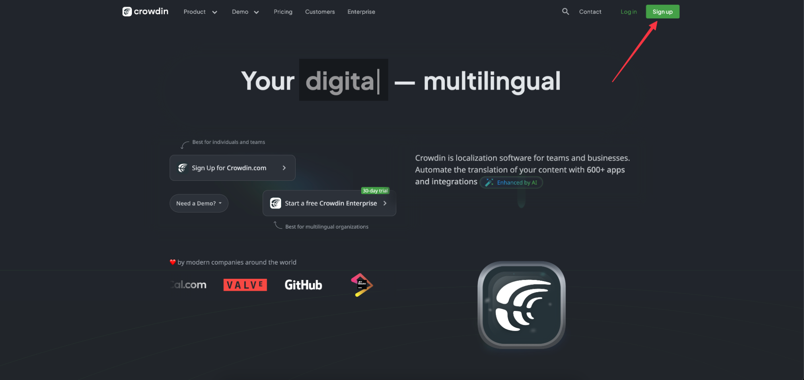

### **Step 2: Join the Vexl Translation Project**

1. Once logged in, navigate to the Vexl project page ([https://crowdin.com/project/vexl](https://crowdin.com/project/vexl)).

2. Click on ‘Join Project’.

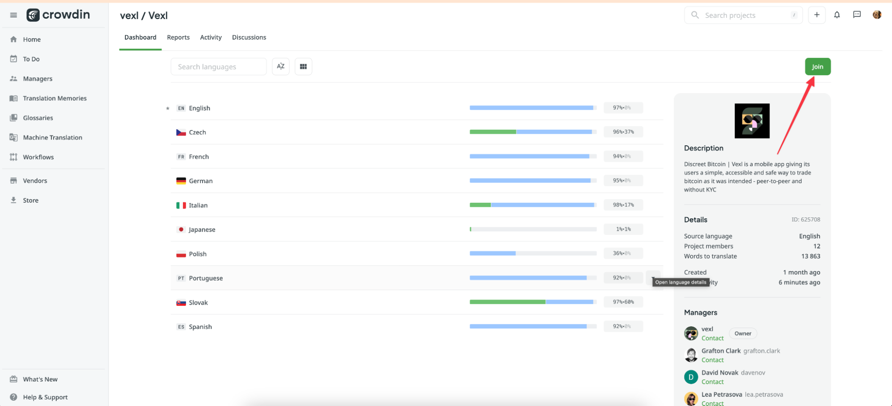

### **Step 3: Select your Language**

1. Select the language you want to translate Vexl into.
2. If your language isn't listed, request it by contacting us (marketing@vexl.it).

### **Step 4: Start Translating**

1. After selecting your language, you’ll see a list of files available for translation.

2. Click on a file to start translating.

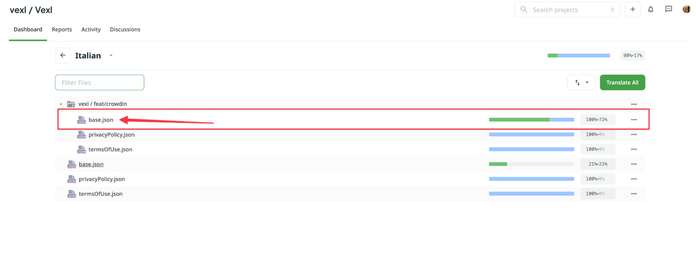

### **Step 5: Translate Text**

1. You’ll see the source text and a space to enter your translation.

2. Type your translation in the provided space.

3. Click 'Save' or hit 'Enter' to save your translation.

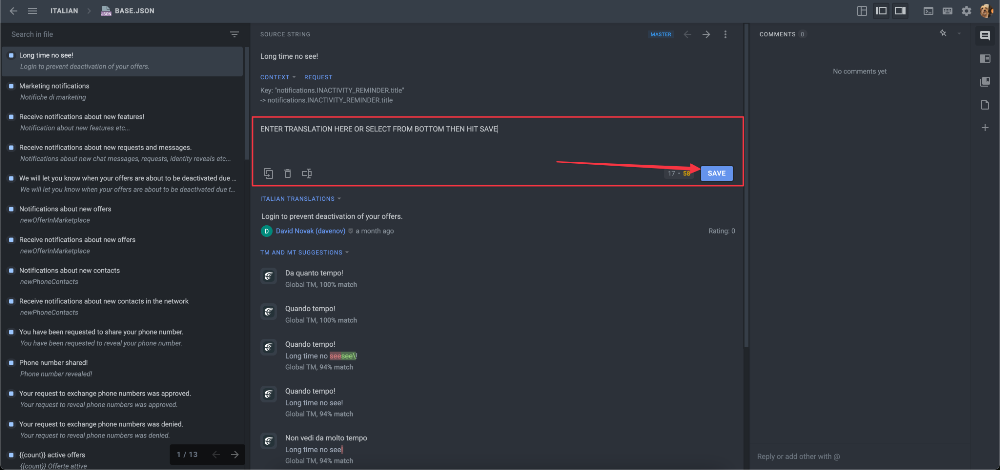

### **Step 6: Use Translation Memory and Glossary**

- Crowdin provides a Translation Memory and Glossary to ensure consistency.
- Check these resources to see if common phrases or technical terms have already been translated.

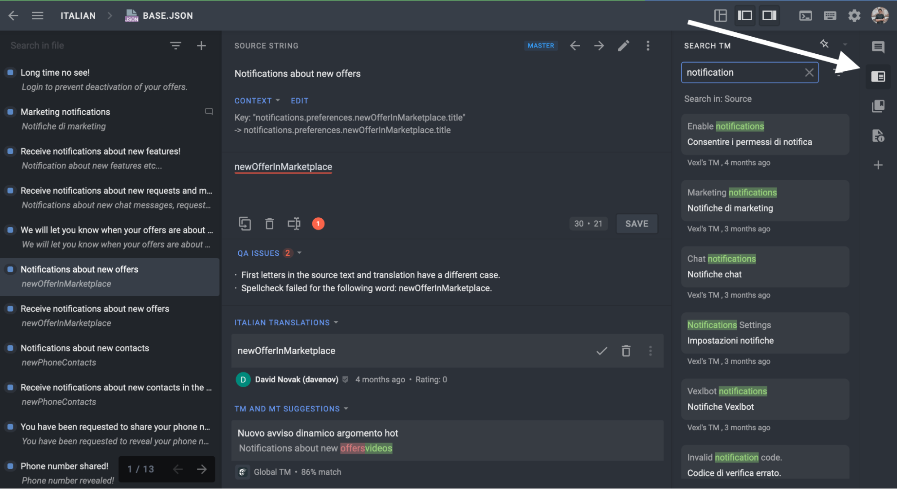

### **Step 7: Suggesting Alternatives**

- If you think there's a better translation for a phrase, you can suggest an alternative.
- Other translators can vote on these suggestions.

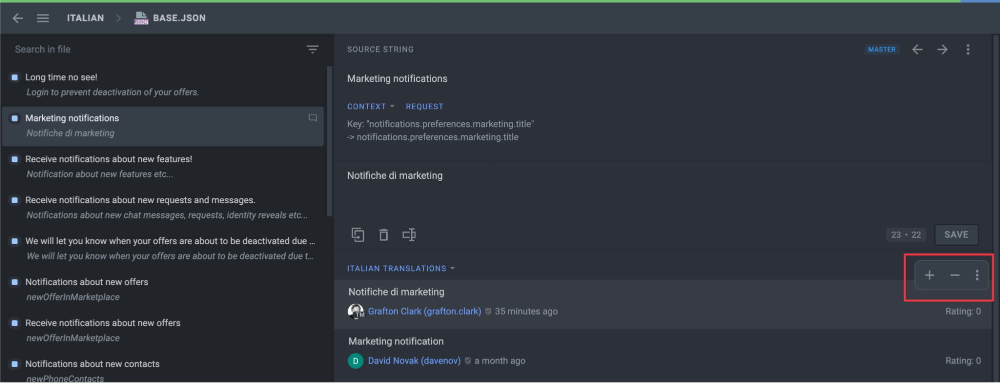

### **Step 8: Review and Edit**

- Regularly review your translations and make edits if necessary.
- You can also review and vote on translations suggested by others.

## **CrowdIn Interface tips**

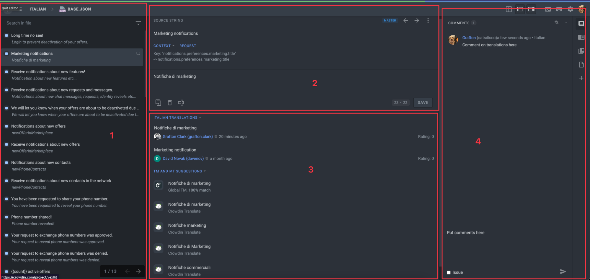

### **Section 1 - Left Sidebar**

This section displays the list of strings, with the active one highlighted. Strings are text elements that are either individual words, phrases, or sentences. Some strings might have replacement tokens (e.g., {0}, {1}, %1, etc.) or elements of the [ICU message syntax](https://support.crowdin.com/icu-message-syntax/). Such items themselves should not be translated but are used by the website code to dynamically insert some information into strings. To work with such strings, you should copy the source string and translate only the real words.

Strings can have the following statuses:

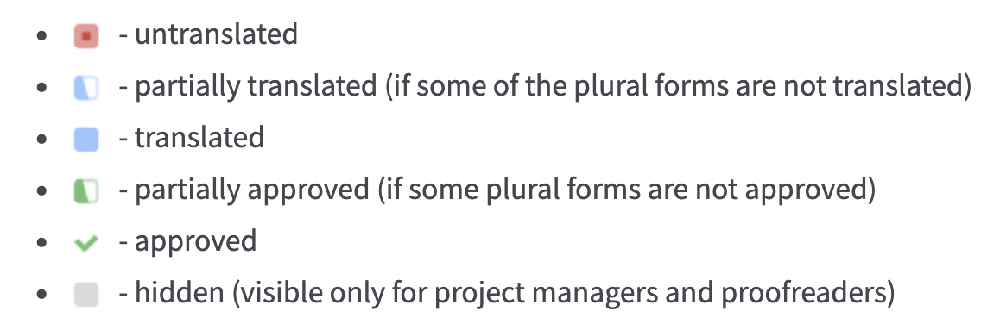

There also might be the following icons besides strings:

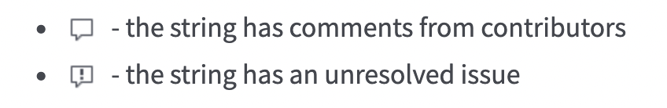

### **Section 2 - Middle-Top Area**

The main working area with the source string at the top and the translation section below. To add a translation, you need to select a string from the left section, and it will appear in the middle-top _Source String_ field.

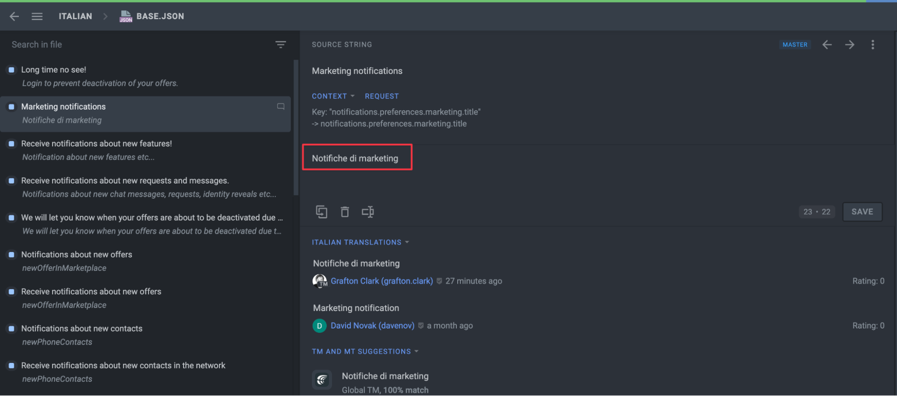

This area also displays the context of a string. Context can include the technical details, an explanation of where the line appears in the actual product, or a screenshot showing the location of the string in a user interface. If the source string has no context and it’s not clear how to translate it, click **Request** and the project manager will be notified that additional explanation is needed.

Enter the translation in the field below the original text in the middle section and click **Save**. You will be automatically redirected to the next string.

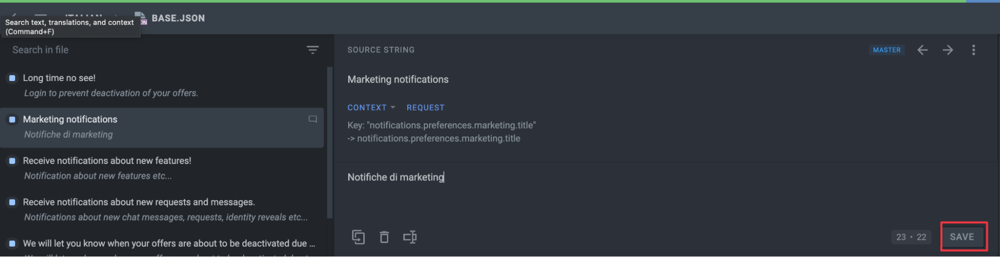

### **Section 3 - Middle-Bottom Area**

This section contains the resources that might be useful:

- Translations by other project participants
- Translation Memory (TM) suggestions
- Machine Translation (MT) suggestions
- Translations to other languages

Click on one of the suggestions, and it will automatically appear in the translation field. Refer to it as a basis for your own suggestions.

To quickly copy the TM or MT suggestion to the translation field and save it, click

**Use and Save**

on the desired suggestion.

_Other Languages_ section allows you to check the string translations into other target languages. This can be a useful tip for multilingual people and while translating dialects of a language.

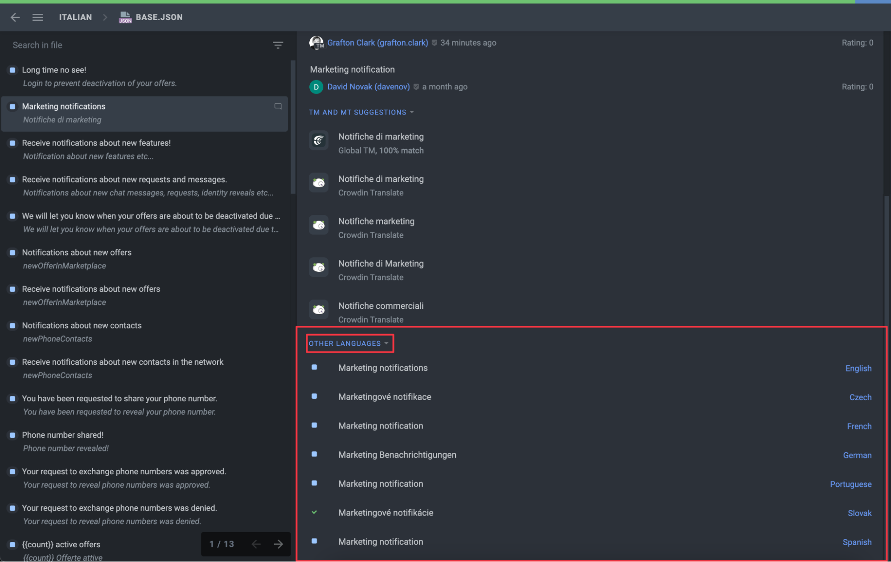

If you see that there is already a correct suggestion, vote for it.

### **Section 4 - Right Sidebar**

### **Comments**

Using the _Comments_ tab, you can discuss the meaning of the source string or other related questions. It is recommended to use a source language of the project so other translators can understand it. Use “@” and a username to direct your message to the specific person.

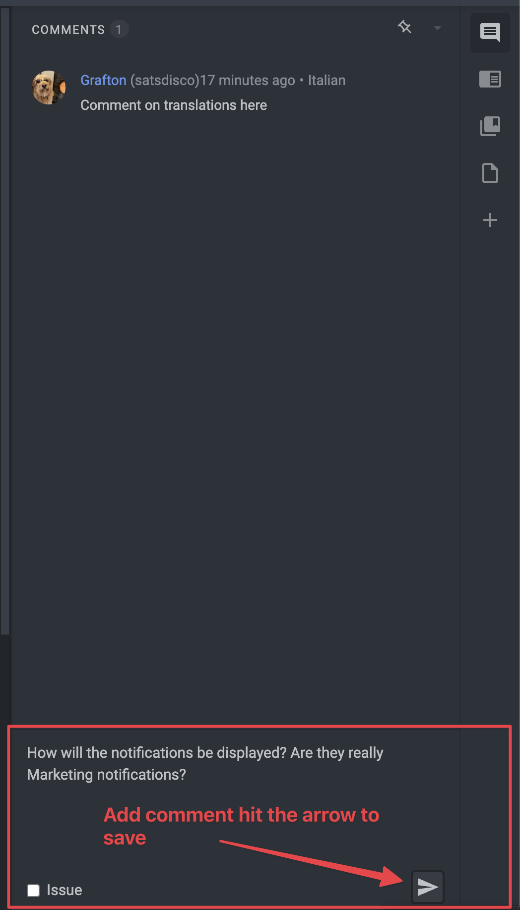

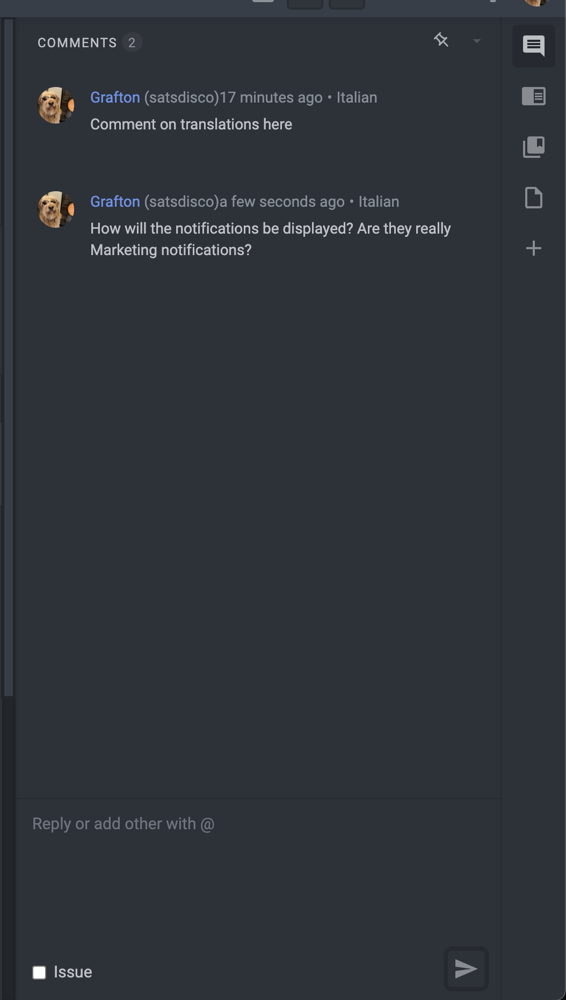

### **Reporting Issues**

Additionally, in the _Comments_ tab, you can report the issues regarding the source strings or translations to the project managers by selecting the _Issue_ checkbox.

Available issue types:

- General question – General question related to the source string or its translations.
- Current translation is wrong – The translation added to the source string is incorrect and requires correction.
- Lack of contextual information – The meaning of the string isn’t clear and requires additional clarification.
- Mistake in the source string – The source string text contains typos or any other mistakes.

All strings with unresolved issues could be filtered using the With Unresolved Issues options.

# **How to Enable String Context View in Vexl**

## **Introduction**

To aid our translators, we've enabled a 'String Context View' feature in the Vexl app. This tool shows where text appears in the app, making it easier to understand the context for each string. Follow these steps to enable it:

## **Step-by-Step Guide**

### **Step 1: Access Debug Screen Mode**

1. **Open the Vexl App**: Start by launching the Vexl app on your device.

2. **Open User Profile**: Tap the person icon located at the bottom of the app.

3. **Find App Version**: Scroll to the bottom of this page to find the app version.

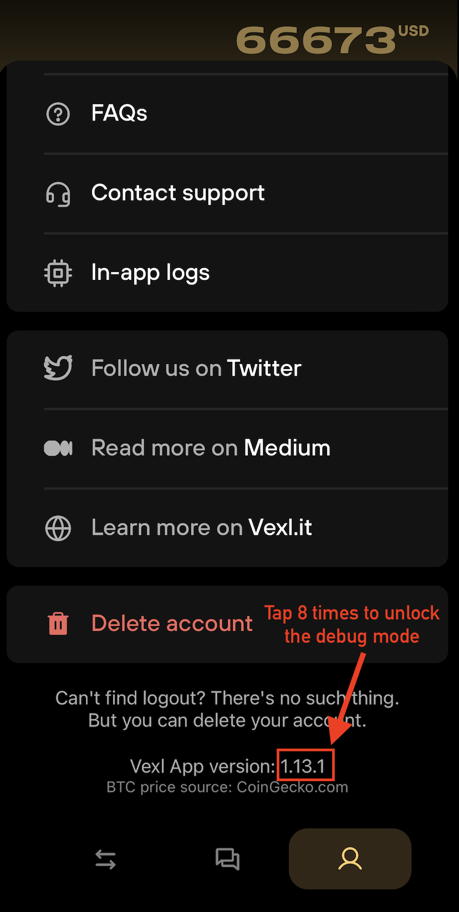

### **Step 2: Enable Translation Mode**

1. **Activate Translation Tools**: Tap the app version number 8 times. A notification will pop up indicating that Debug Screen Mode is enabled.

### **Step 3: Choose Your Language**

1. **Select Language**: In the menu, select the language you are translating into.

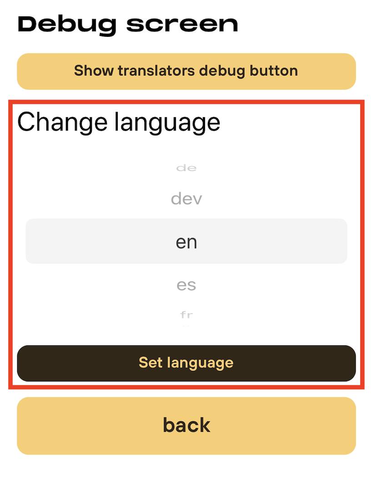

### **Step 4: Enable Translators Debug Mode**

1. **Find Translators Debug Mode**: Click the Translators Debug Button.

2. **Toggle On**: Look for 'Show Translators Debug Mode' and toggle it on. This will add a magnifying glass icon in the Vexl app.

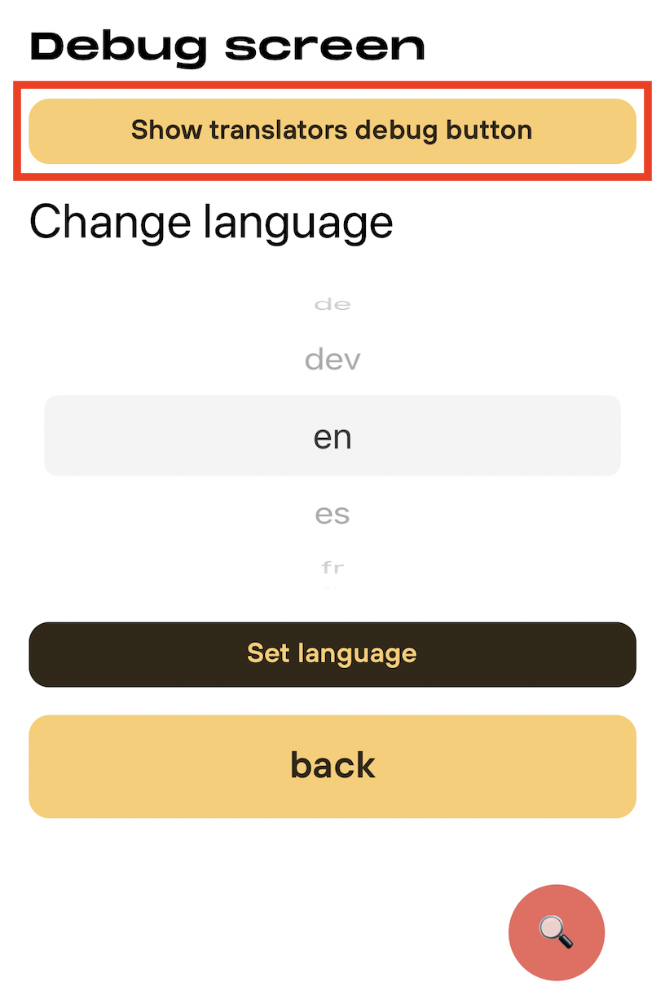

### **Step 5: Use the Magnifying Glass for Context**

1. **Access Context Strings**: Tap the magnifying glass icon whenever you need to see the context strings.

2. **Search in Crowdin**: Use these context strings to search in the Crowdin Translation interface for a more accurate translation.

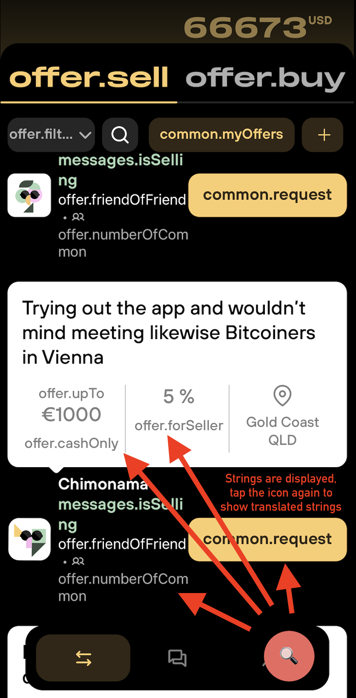

### **Step 6: Disable Text Debug Mode**

1. **Return to Debug Screen Mode**: If you want to disable the 'Show Translators Debug Mode', simply return to the Developer Tools.
2. **Toggle Off**: Find 'Show Text Debug Mode' and toggle it off to remove the magnifying glass icon from the app.

## **Conclusion**

With the String Context View feature, you can easily translate and localize the Vexl app with a better understanding of how text is used within the app. This feature will significantly enhance the accuracy and relevance of your translations.

Thank you for contributing to the Vexl community! Your efforts help make Vexl accessible to people all around the world. For any questions or assistance, don’t hesitate to reach out to us.
