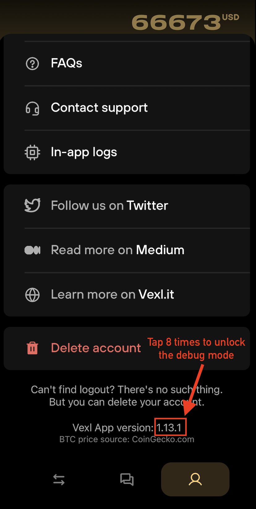
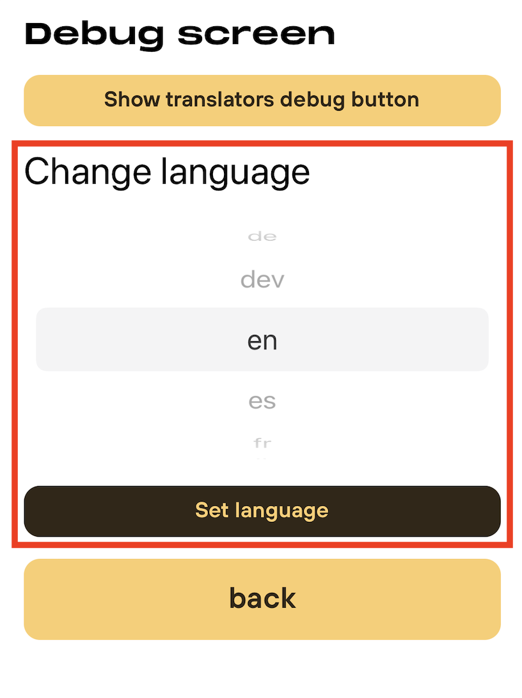
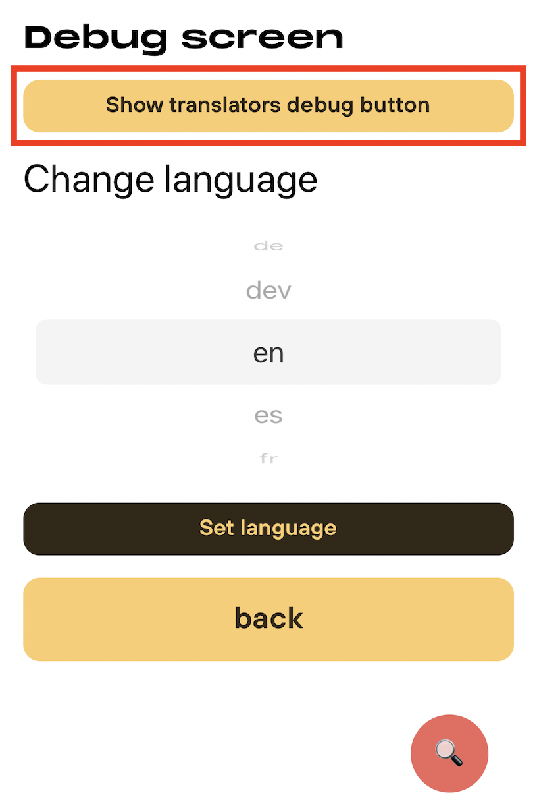

# How to Help Translate and Localize Vexl

Vexl translations are AI-generated and live directly in this repository — English is the source of truth, and translated locale files are committed under `packages/localization/locales/<language>/`. Corrections from native speakers are the human review this system relies on.

To fix a translation, open a pull request editing the relevant locale JSON file (or report it in a [GitHub issue](https://github.com/vexl-it/vexl/issues/new)). Keep the dotted keys and `{{variable}}` placeholders unchanged. Once merged, your correction is permanent — the repository is the only source of translations.

## Translators Debug Mode

The Vexl app can show the translation key for text on screen, making it easier to identify the right entry in a locale file or describe a correction.

### Step 1: Open the Debug Screen

1. Open the Vexl app.
2. Open your user profile by tapping the person icon at the bottom of the app.
3. Scroll to the app version and tap it 8 times. A notification confirms that Debug Screen Mode is enabled.

### Step 2: Choose Your Language

Select the language you are reviewing from the language picker in the Debug Screen.

### Step 3: Enable Translators Debug Mode

Open the Translators Debug section and turn on **Show Translators Debug Mode**. A floating magnifying-glass button (🔍) appears in the app.

### Step 4: Inspect Translation Keys

Tap the floating 🔍 button whenever you need to see the keys for text on the current screen. Use those keys to find the translation under `packages/localization/locales/<language>/` or include them in your issue.

### Step 5: Disable Translators Debug Mode

Return to the Debug Screen and turn off **Show Translators Debug Mode** to remove the floating button.

Thank you for helping make Vexl clear and accessible in more languages.
